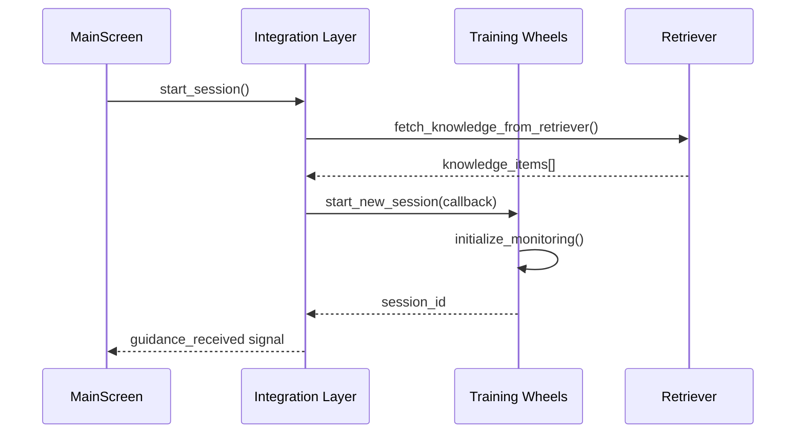
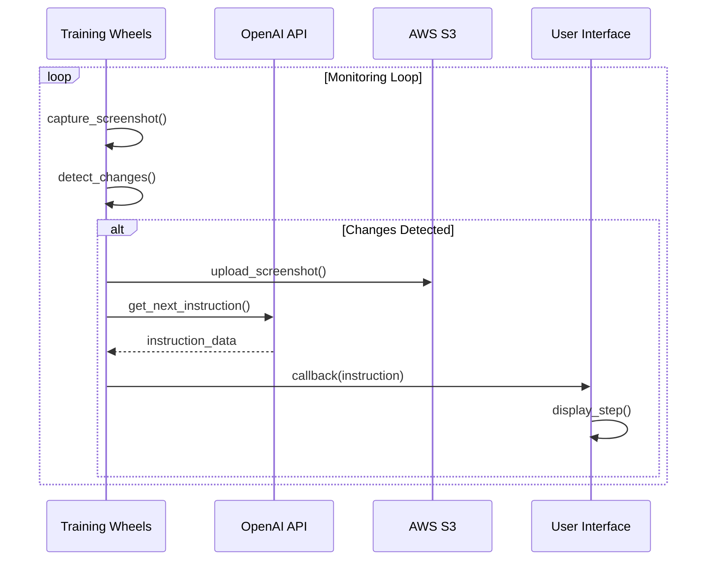
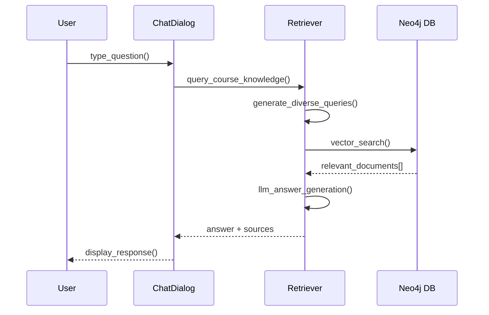

# TrainingWheels

TrainingWheels is a Python-based application designed to provide real-time, step-by-step guidance to users for completing various tasks. It captures screenshots of a user's screen, analyzes them to understand the current state, and provides instructions to guide the user towards their goal. The application is built with a modular architecture, allowing for easy extension and maintenance.

## Key Features

- **Real-time Step-by-Step Guidance**: The application monitors the user's screen and provides instructions for each step of a task.
- **Intelligent Step Generation**: It uses a Large Language Model (LLM) to generate instructions based on the user's goal and the current state of the screen.
- **Knowledge-Based Guidance**: The application can be augmented with a knowledge base to provide more accurate and context-aware instructions.
- **Asynchronous Operations**: Network and other long-running operations are handled asynchronously to ensure a responsive user interface.
- **Screenshot Management**: The application captures screenshots of the user's screen, detects significant changes, and uploads them to an S3 bucket for analysis.
- **Chat Integration**: Users can interact with a chat assistant to ask questions and receive help during a session.
- **Text-to-Speech**: The application can provide audio guidance for each step.

## Architecture

The application is composed of the following key modules:

- **`learnchain_tutor.py`**: This is the main entry point of the application and contains the user interface (UI) code, built with PyQt6. It handles user interactions, displays instructions, and manages the overall state of the application.
- **`training_wheels.py`**: This module contains the core logic for the TrainingWheels application. It manages the session state, coordinates the screenshot capture and analysis, and interacts with the LLM to generate instructions.
- **`retriever.py`**: This module is responsible for retrieving information from a knowledge base to provide more accurate and context-aware guidance. It uses a combination of vector-based and graph-based retrieval techniques.
- **`ui_integration.py`**: This module contains the code for integrating the TrainingWheels functionality with the main application UI. It provides a set of functions for starting and stopping sessions, adding knowledge, and handling user interactions.

## Getting Started

To get started with the TrainingWheels application, you will need to have the following prerequisites installed:

- Python 3.6 or higher
- An AWS account with access to S3 and Polly
- An OpenAI API key

Once you have the prerequisites, you can install the required dependencies by running the following command:

```
pip install -r requirements.txt
```

Next, you will need to configure the application by setting the following environment variables:

- `AWS_ACCESS_KEY_ID`: Your AWS access key ID.
- `AWS_SECRET_ACCESS_KEY`: Your AWS secret access key.
- `AWS_DEFAULT_REGION`: The AWS region to use for S3 and Polly.
- `OPENAI_API_KEY`: Your OpenAI API key.

Once you have configured the application, you can run it by executing the following command:

```
python learnchain_tutor.py
```

## Usage

When you run the application, you will be prompted to select a screen region to monitor. This region should include the application or browser window that you will be using for the training session. Once you have selected a region, you can enter your goal and start the session.

The application will then provide you with step-by-step instructions to complete your goal. You can interact with the chat assistant at any time to ask questions or receive help.

---------------------------------------------------------------------------------------------------------------------------------------------------------------------------------------------------------

# Developer Guide:

# Training Wheels Application Architecture

## Overview
The Training Wheels application provides AI-powered step-by-step guidance by monitoring user screens and generating contextual instructions. It consists of 4 main components working together through a sophisticated communication system.

## Architecture Layers

```
┌─────────────────────────────────────────────────────────────┐
│                    Main UI Layer                            │
│                (learnchain_tutor.py)                        │
│  • PyQt6 Interface                                          │
│  • User Login/Goal Input                                    │
│  • Step Display & Chat                                      │
│  • Animation & Audio                                        │
├─────────────────────────────────────────────────────────────┤
│                  Integration Layer                          │
│                 (ui_integration.py)                         │
│  • Dynamic Method Enhancement                               │
│  • Signal/Slot Management                                   │
│  • Background Workers                                       │
│  • Thread-Safe Communication                               │
├─────────────────────────────────────────────────────────────┤
│              Core Training Wheels Engine                    │
│                (training_wheels.py)                         │
│  • Session Management                                       │
│  • Screenshot Monitoring                                    │
│  • LLM Integration (OpenAI)                                 │
│  • S3 Storage & Audio (AWS)                                │
├─────────────────────────────────────────────────────────────┤
│               Knowledge Retrieval System                    │
│                  (retriever.py)                            │
│  • Neo4j Vector Database                                    │
│  • LangChain Integration                                    │
│  • Multi-Query Retrieval                                   │
│  • OpenAI Embeddings                                       │
└─────────────────────────────────────────────────────────────┘
```

## Component Communication Matrix

| From Component | To Component | Communication Method | Purpose |
|---------------|--------------|---------------------|---------|
| UI Layer | Integration Layer | PyQt Signals/Slots | User actions, state changes |
| Integration Layer | Training Wheels | Function calls + Callbacks | Session control, step requests |
| Training Wheels | Integration Layer | Callback functions | New guidance, status updates |
| Integration Layer | UI Layer | PyQt Signals | Display updates, errors |
| Integration Layer | Retriever | Direct function calls | Knowledge fetching |
| UI Layer | Retriever | Direct function calls | Chat functionality |
| Training Wheels | LLM/S3/AWS | HTTP/API calls | Instruction generation, storage |

## Key Communication Flows

### 1. Session Initialization


### 2. Real-time Guidance Loop


### 3. User Chat Interaction


## Integration Mechanisms

### 1. Dynamic Method Enhancement
The integration layer enhances the UI by replacing methods:

```python
# Store original method
original_start_session = MainScreen.start_session

def enhanced_start_session(self):
    original_start_session(self)  # Keep original behavior
    # Add Training Wheels functionality
    session_id = tw.start_new_session(
        self.user_id, self.course_id, self.goal,
        step_callback  # Critical callback connection
    )

# Replace the method
MainScreen.start_session = enhanced_start_session
```

### 2. Thread-Safe Communication
Uses PyQt signals for cross-thread safety:

```python
# Signal definition
guidance_received = pyqtSignal(dict)

# Background thread callback
def step_callback(guidance_data):
    # Emit signal to UI thread
    self.guidance_received.emit(guidance_data)

# UI thread handler  
def _handle_guidance(self, guidance):
    self.add_instruction(guidance)  # Safe UI update
```

### 3. Background Processing
Knowledge retrieval runs in background threads:

```python
class BackgroundWorker(QThread):
    finished = pyqtSignal(object)
    
    def run(self):
        knowledge = fetch_knowledge_from_retriever(goal, course_id)
        self.finished.emit(knowledge)
```

## State Management

### Multi-Layer State Tracking
- **UI State**: PyQt widget states, current step, session flags
- **Session State**: Training Wheels `SessionState` class with JSON persistence
- **External State**: S3 storage, Neo4j database, OpenAI context

### State Synchronization Points
1. **Session Start**: All layers initialize and sync
2. **Step Generation**: Training Wheels updates session, UI reflects changes
3. **User Actions**: UI updates propagate to Training Wheels
4. **Chat Interactions**: Stored in session state for LLM context
5. **Session End**: All states persisted to S3

## Key Design Patterns

### 1. **Observer Pattern**
- UI observes Training Wheels through callbacks and signals
- Multiple UI components can react to state changes

### 2. **Command Pattern**  
- User actions encapsulated as method calls
- Enhanced methods add Training Wheels functionality

### 3. **Strategy Pattern**
- Different retrieval strategies (single vs multi-query)
- Configurable screenshot change detection

### 4. **Facade Pattern**
- Integration layer provides simplified interface to complex Training Wheels system
- UI doesn't need to know internal Training Wheels complexity

## Error Handling & Resilience

### Graceful Degradation
- S3 failure → falls back to local storage
- LLM failure → shows error message, continues session
- Knowledge retrieval failure → proceeds with general guidance

### Thread Safety
- All UI updates go through PyQt signals
- Background errors propagated via signals
- Proper thread cleanup on session end

## Configuration & Extensibility

### Configuration Sources
1. **Environment Variables**: API keys, AWS credentials
2. **Config Class**: Timeouts, thresholds, feature flags  
3. **Runtime Settings**: User preferences, explanation mode

### Extension Points
- **New UI Components**: Add to integration layer
- **Additional Data Sources**: Extend retriever system
- **New LLM Providers**: Modify LLMManager
- **Custom Screenshot Processing**: Extend ScreenshotManager

This architecture provides a robust, maintainable system that cleanly separates concerns while enabling sophisticated real-time guidance functionality.
